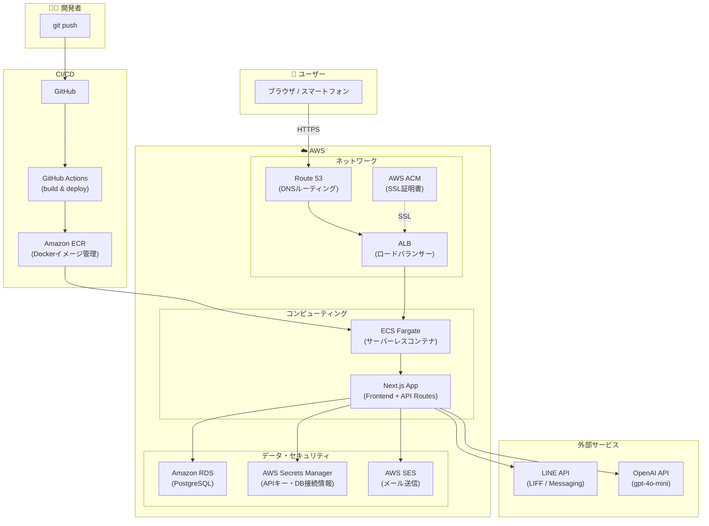

# 心臓リハビリ手帳 💖

日々の健康を、記録に残そう。

心臓疾患を持つ患者が日々の健康を安心して管理できるWebアプリケーションです。
元理学療法士が開発し、医療現場の課題をITで解決することをコンセプトにしています。

### [リンク]: [https://app.patient-held-diary.org](https://app.patient-held-diary.org)

### [GitHub]: [https://github.com/mikan623/heart-rehab-app](https://github.com/mikan623/heart-rehab-app)

---

# 開発背景

病院勤務では心臓リハビリテーションに携わり、患者様の継続的な健康管理を支援してきました。しかし、病院側では紙媒体の手帳による管理が中心である一方、40代〜50代の患者様の多くはスマートフォンのカレンダーアプリを活用してバイタル管理を行っており、管理方法にギャップがあることに気づきました。そこで、バイタル管理を専用アプリとして提供することで、より利便性の高い管理が実現できるのではないかと考えました。

上記から、より継続しやすく利便性の高い管理方法の必要性を感じ、現在は心臓リハビリ手帳を開発し運用しております。

---

# 機能一覧


| 機能        | 内容                                   |
| --------- | ------------------------------------ |
| 健康記録      | 血圧・脈拍・体重・運動・食事・服薬を毎日記録               |
| AI健康アドバイス | 直近7日間の記録を元にOpenAIがパーソナライズされたアドバイスを生成 |
| 血液検査データ管理 | HbA1c・コレステロール・BNPなどの検査値を管理           |
| CPXデータ管理  | 心肺運動負荷試験（VO2・METs・AT）の結果を記録          |
| グラフ表示     | 健康データの推移をグラフで可視化                     |
| カレンダー     | 過去の記録をカレンダーから確認・編集                   |
| 家族共有      | 健康記録をLINE通知で家族にリアルタイム共有              |
| 医療従事者画面   | 担当患者の健康記録・検査データを一覧管理                 |
| PDFエクスポート | 健康記録をPDFで出力・印刷                       |
| LINEログイン  | LINE LIFF（OIDC）によるワンタップログイン          |
| メールログイン   | メールアドレス＋パスワードでのログイン・新規登録             |
| パスワードリセット | メール経由でのパスワードリセット                     |
| リマインダー    | 記録忘れをLINEで通知                         |
| 学習コンテンツ   | 心臓リハビリ・血圧管理・運動療法などの知識コンテンツ           |


---

# 使用技術

### フロントエンド

- **Next.js 16（Turbopack）** / **React 19** / **TypeScript**
- **Tailwind CSS v4**
- **Chart.js** / react-chartjs-2
- **jsPDF** / html2canvas

### バックエンド

- **Next.js API Routes**
- **Prisma ORM**
- **PostgreSQL**
- **Nodemailer**（AWS SES）

### インフラ

- **AWS ECS Fargate** / **ECR**
- **AWS Secrets Manager**
- **Docker**
- **GitHub Actions**（CI/CD）

### 外部連携

- **LINE LIFF** / **LINE Messaging API**
- **OpenAI API**（gpt-4o-mini）

---

# クラウドアーキテクチャ




---

# 技術選定理由と背景

### フロントエンド


| 技術                        | 選定理由                                                                                               |
| ------------------------- | -------------------------------------------------------------------------------------------------- |
| **Next.js 16（Turbopack）** | フロントエンドとAPI Routesを1つのリポジトリで完結できるため、個人開発での管理コストを抑えられると判断しました。SSRによる初期表示の高速化も、患者様が使うアプリとして重要な要素でした。 |
| **TypeScript**            | 医療データを扱う以上、型安全性は妥協できませんでした。コンパイル時にエラーを検出できることで、実行時のバグを大幅に減らせると感じ採用しています。                           |
| **Tailwind CSS v4**       | 患者様がスマートフォンで使うことを前提にしていたため、モバイルファーストでレスポンシブUIを効率よく構築できるTailwindを選びました。                             |
| **Chart.js**              | 血圧・体重などのバイタルデータは「数値」より「推移の流れ」で見せることが臨床的にも重要だと感じていました。軽量で導入しやすい点も評価しています。                           |
| **jsPDF / html2canvas**   | 受診時に記録を印刷して医師に見せられる機能は、臨床経験から必要性を強く感じていました。外部サービスへの依存なくクライアントサイドでPDF生成できる点が決め手です。                  |


### バックエンド


| 技術                       | 選定理由                                                                                              |
| ------------------------ | ------------------------------------------------------------------------------------------------- |
| **Prisma ORM**           | 型安全なデータベースアクセスにより、医療データの誤操作リスクを減らせます。スキーマファイルでDB構造を一元管理できるため、保守性も高いと判断しました。                       |
| **PostgreSQL**           | 健康記録・血液検査・CPXデータなど複数テーブルの関係を持つ構造化データを扱うため、リレーショナルDBが適していると判断しました。                                 |
| **JWT（httpOnly Cookie）** | localStorageへのトークン保存はXSSによる窃取リスクがあるため、httpOnly CookieでJWTを管理する方針を採用しました。セキュリティをきちんと学びながら実装した部分です。 |


### インフラ


| 技術                      | 選定理由                                                                                            |
| ----------------------- | ----------------------------------------------------------------------------------------------- |
| **AWS ECS Fargate**     | サーバーレスでコンテナを運用できるため、インフラ管理の負担を最小化しながら本番環境を安定稼働させられます。個人開発でも運用しやすい構成として選びました。                    |
| **Docker**              | ローカルと本番環境の差異をなくし、デプロイ時の予期しないエラーを防ぐために導入しました。                                                    |
| **GitHub Actions**      | mainブランチへのpushをトリガーに自動でビルド・デプロイが走るCI/CDパイプラインを構築しました。手動デプロイによるミスをなくし、開発サイクルを効率化するために早期から整備しました。 |
| **AWS Secrets Manager** | APIキーやDB接続情報をコードから分離して管理するために採用しました。セキュリティ要件として、シークレットは必ずコード外で管理する方針にしています。                     |


### 外部連携


| 技術                          | 選定理由                                                                                                                |
| --------------------------- | ------------------------------------------------------------------------------------------------------------------- |
| **LINE LIFF**               | 心臓リハビリの主な対象患者層（40〜70代）にとって、新規アカウント登録自体がハードルになると臨床経験から感じていました。LINEのOIDC認証を活用することで、普段使いのアプリからワンタップでログインできる体験を実現しています。 |
| **LINE Messaging API**      | 健康記録を家族にリアルタイムで共有する機能は、患者様の孤立した自己管理を減らすために実装しました。日常的に使われているLINEと統合することで、継続率向上を狙っています。                               |
| **OpenAI API（gpt-4o-mini）** | 記録するだけで終わらず、パーソナライズされたアドバイスまで提供できるアプリにしたかった。レスポンス品質とAPIコストのバランスからgpt-4o-miniを選定しました。                                |
| **AWS SES（Nodemailer）**     | パスワードリセットメールの配信に採用しました。高い到達率と低コストを両立しており、Nodemailerと組み合わせることで既存のNode.js環境にスムーズに統合できました。                             |


---

# 特に見ていただきたい点

- ### フロントエンド面
  - Chart.jsによる血圧・脈拍・体重の推移グラフ表示
  - html2canvas + jsPDFによるPDFエクスポート機能
  - スマートフォン対応のレスポンシブUI（Tailwind CSS）
- ### バックエンド面
  - Prisma ORMによる型安全なデータベースアクセス
  - JWT認証をhttpOnly Cookieで管理し、XSSによるトークン窃取を防止している点
  - LINE LIFF（LINE Front-end Framework）を用いたLINEログインの実装
  - LINE Messaging APIによる家族への健康記録通知・リマインダー機能
  - AWS SES（Nodemailer経由）によるパスワードリセットメール送信
  - OpenAI API（gpt-4o-mini）を活用したAI健康アドバイス機能
- ### インフラ面
  - DockerコンテナをAWS ECS（Fargate）でサーバーレス運用している点
  - GitHub ActionsでCI/CDパイプラインを構築し、mainブランチへのpushで自動デプロイされる点
  - AWS Secrets Managerでシークレットを一元管理し、セキュアな本番運用を実現している点
  - AWS ECRでDockerイメージを管理している点

---

# ローカル起動

```bash
# リポジトリをクローン
git clone https://github.com/mikan623/heart-rehab-app.git
cd heart-rehab-app

# 依存関係をインストール
npm install

# Prismaクライアント生成
npx prisma generate

# 開発サーバーを起動（ポート3002）
npm run dev
```

ブラウザで `http://localhost:3002` を開く

### ゲストユーザーアカウント


| ユーザー            | Email                                             | Password    |
| --------------- | ------------------------------------------------- | ----------- |
| ゲストユーザー1（患者）    | [test@example.com](mailto:test@example.com)       | password123 |
| ゲストユーザー2（医療従事者） | [example@i.cloud.com](mailto:example@i.cloud.com) | password321 |


---

# 作者

**Suzuki Shinoka**

- GitHub: [@mikan623](https://github.com/mikan623)
- 前職：理学療法士（医療機関・リハビリテーション施設）
- 医療現場のIT化に関心を持ち、現場の課題を解決するアプリ開発に取り組んでいます

